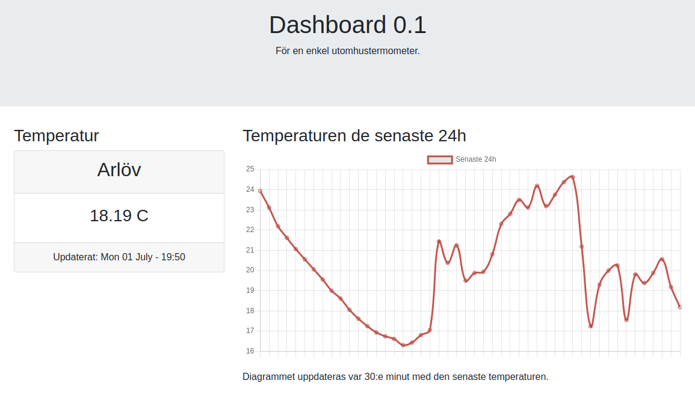

# TempSensor

## Hardware Requirement

* Rpi [Zero W](https://www.electrokit.com/produkt/raspberry-pi-zero-w-board/)
* Temperature sensor [DS18B20](https://www.kjell.com/se/produkter/el-verktyg/utvecklingskit/arduino/tillbehor/temperatursensor-med-kabel-for-arduino-p87081)

## Building

### Usage.

```bash
$ tempsensor <settings.ini>
```

### Build.

* mkdir build
* cd build
* cmake ..
* cd ..
* make -C build
* sudo ./build/tempsensor

### Build gtests.

* mkdir build
* cd build
* cmake .. -Dunittest=ON
* cd ..
* make -C build
* ./build/runUnitTests

### Dependecy.

* libsqlite3-dev
* libmosquitto-dev
* libmosquittopp-dev

### settings.ini

```
# This files contains all settings temperaturesensor,
# edit to fit your needs.
[SensorSettings]
sensor=28-0417a2f482ff
#interval given in minutes
interval=1
[SQLite]
db_file=temperature.db
[mqtt]
server=m24.cloudmqtt.com
port=15786
username=foo
password=bar
topic=lek
```

## Frontend

A simple webpage with a basic js mqtt client. Displaying current temperature and the temperature for the last 24h. Edit to fit your needs.



## Hardware

### Setup DS18B20
Your DS18B20 should be connected to pin 7 (BCM4), gnd, and 3v.

Edit /boot/config.txt
```bash
# Enable gpio for DS18BS20
dtoverlay=w1-gpio,pinout=4,pullup=on
```

Edit /etc/modules
```bash
# /etc/modules: kernel modules to load at boot time.
#
# This file contains the names of kernel modules that should be loaded
# at boot time, one per line. Lines beginning with "#" are ignored.
w1-gpio pullup=1
w1-therm strong_pullup=1
```

check for /sys/bus/w1/devices/28-xxxxxxxxxx 
